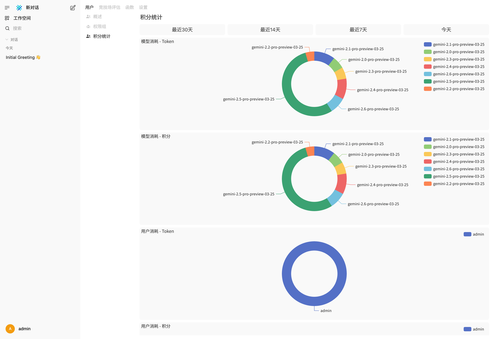
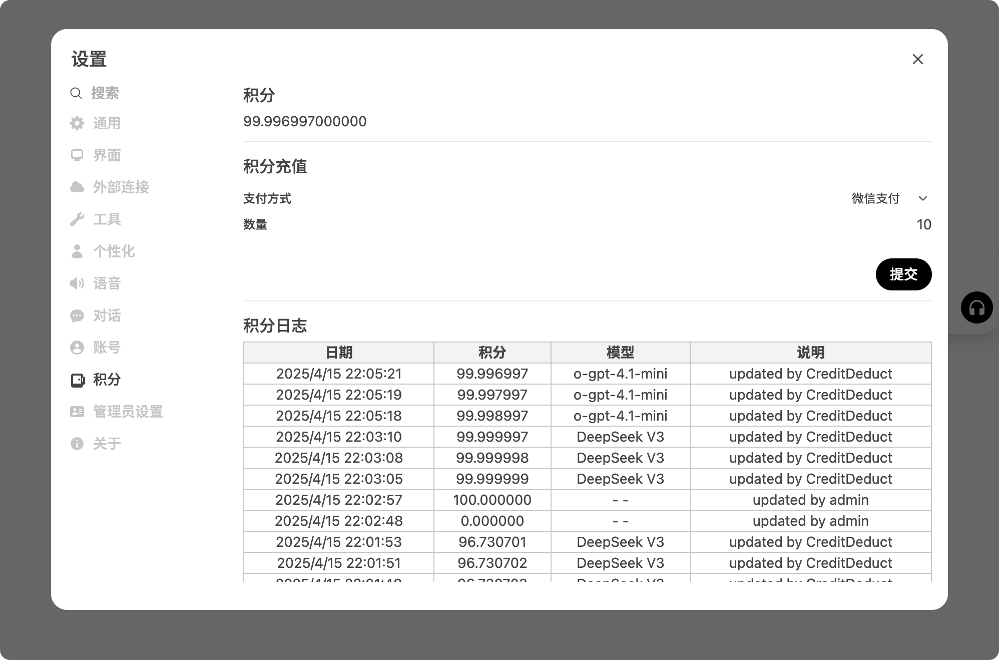

> 注意：此仓库的 `dev` 分支是开发分支，可能包含不稳定或未发布的功能。强烈建议用户在部署和生产环境中使用无预发布标签的正式版本。  
> 该项目是社区驱动的开源 AI 平台 [Open WebUI](https://github.com/open-webui/open-webui) 的定制分支。此版本与 Open WebUI 官方团队没有任何关联，亦非由其维护。

# Open WebUI 👋

官方文档: [Open WebUI Documentation](https://docs.openwebui.com/).  
官方更新日志: [CHANGELOG.md](./CHANGELOG.md)

## 部署方式

部署二开版本只需要替换镜像和版本，其他的部署与官方版本没有差别，版本号请在 [Release](https://github.com/U8F69/open-webui/releases/latest) 中查看

```
ghcr.io/u8f69/open-webui:<版本号>
```

## 拓展特性

完整特性请看更新日志 [CHANGELOG_EXTRA.md](./CHANGELOG_EXTRA.md)

### 积分报表



### 全局积分设置


### 用户积分管理与充值



### 按照 Token 或请求次数计费，并在对话 Usage 中显示扣费详情


### 兑换码


### 支持注册邮箱验证


## 拓展配置

### 兑换码功能

需要使用 Redis 避免被多次兑换

```
REDIS_URL=redis://:<password>@<host>:6379/0
```

### 自定义价格配置

可以对请求 Body 中的任何匹配的内容额外计费，例如 OpenAI 和 Gemini 原生网页搜索  
此部分配置较为复杂，如有需要可以提 ISSUE 单获取支持，或者使用 LLM 生成，Prompt 为 "参考这个例子，生成一个 XXX 的配置"，并提供下面的例子

```json
[
	{
		"name": "web_search", // 计费名称，使用纯英文和下划线
		"path": "$.tools[*].type", // python jsonpath_ng 兼容的解析路径
		"exists": false, // 是否检测到 path 就计费，优先级高于 value 匹配
		"value": "web_search_preview", // 匹配的值
		"cost": 1000000 // 1M 次请求的价格
	}
]
```

### HTTP Client Read Buffer Size

当有遇到 `Chunk too big` 报错时，可以适当调节这里的大小

```
# 默认是 64KB
AIOHTTP_CLIENT_READ_BUFFER_SIZE=65536
```

### 注册邮箱验证


请在管理端打开注册邮箱验证，配置 WebUI URL，同时配置如下环境变量

```
# 缓存
REDIS_URL=redis://:<password>@<host>:6379/0

# 邮件相关
SMTP_HOST=smtp.email.qq.com
SMTP_PORT=465
SMTP_USERNAME=example@qq.com
SMTP_PASSWORD=password
```

### 增强的代码块和其他样式

默认是开启状态，如需关闭请设置环境变量为非 `true` 的值

```
# 增强的代码块
STYLE_USE_ENHANCED_CODE_BLOCK=true
# 输入框右下角额外的 Markdown 编辑器
STYLE_USE_ENHANCED_MARKDOWN_EDITOR=true
```

### 品牌/LOGO定制能力说明

本项目尊重并遵守 [Open WebUI License](https://docs.openwebui.com/license) 的品牌保护条款；我们鼓励社区用户尽量保留原有 Open WebUI 品牌，支持开源生态！

如需自定义品牌标识（如 LOGO、名称等）：

- 请务必确保您的实际部署满足 License 所要求的用户规模、授权条件等（详见 [官方说明#9](https://docs.openwebui.com/license#9-what-about-forks-can-i-start-one-and-remove-all-open-webui-mentions)）。
- 未经授权的商用或大规模去除品牌属于违规，由使用者自行承担法律风险。
- 具体自定义方法见 [docs/BRANDING.md](./docs/BRANDING.md)。
